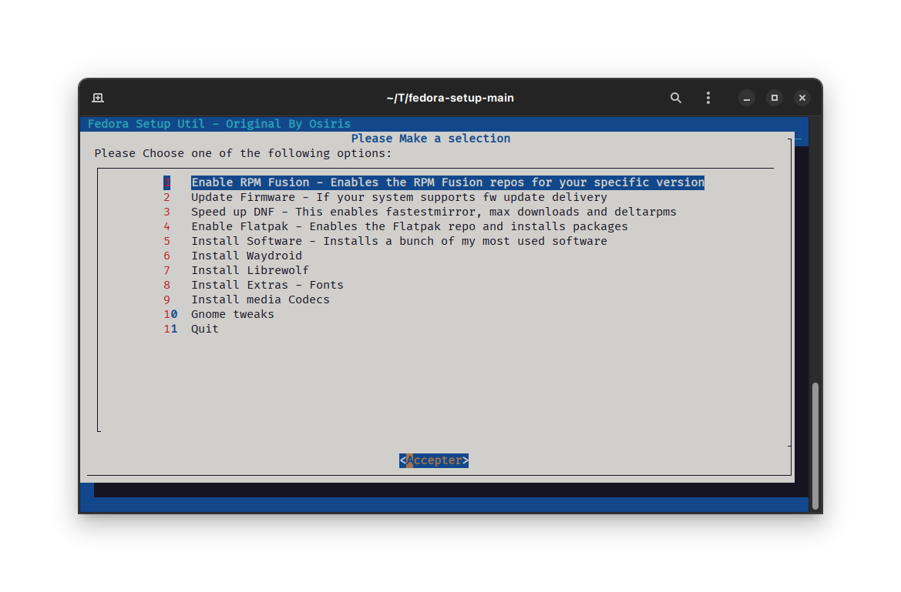

# Post Install Script for Fedora / credits to [osiris2600](https://github.com/osiris2600/fedora-setup)

## What's all this then?

Fedora-Setup is a personal script to help with post install tasks such as tweaks and software installs. Written in Bash and utilises Dialog for a friendlier menu system.

Dialog must be installed for the menu system to work and as such the script will check to see if Dialog is installed. If not, it will ask you to install it.

## Usage
1. Set the script to be executable `chmod -x fedora-setup.sh` \
2. Run the script `./fedora-setup.sh`

## Files

- **flatpak-packages.txt** - This file contains a list of all flat packages to install you can customise this with your choice of applications by application-id.
- **dnf-packages.txt** - This file contains a list of all applications that will be installed via the Fedora and RPMFusion repositories.

## Screenshot

# Options

- ## Enable RPM Fusion
  - Enables RPM Fusion repositories using the official method from the RPM Fusion website. - [RPM Fusion](https://rpmfusion.org)
  > RPM Fusion provides software that the Fedora Project or Red Hat doesn't want to ship. That software is provided as precompiled RPMs for all current Fedora versions and current Red Hat Enterprise Linux or clones versions; you can use the RPM Fusion repositories with tools like yum and PackageKit.
- ## Update Firmware
  - **Updates firmware providing you have hardware that supports it.**
- ## Speed up DNF
  - **Enables fastest mirror**
  - **Sets max parallel downloads to 10**
  - **Enables DeltaRPMs**
- ## Enable Flatpak and install Packages
  ### Adds the flatpak repo, updates and installs the following packages (or what you have specified in flatpak-packages.txt)
  - com.belmoussaoui.Obfuscate
  - org.gnome.gitlab.YaLTeR.VideoTrimmer
  - org.signal.Signal
  - com.github.tchx84.Flatseal
  - com.mattjakeman.ExtensionManager
  - com.github.Eloston.UngoogledChromium
  - com.github.qarmin.czkawka
  - com.spotify.Client
  - com.sublimetext.three
  - dev.geopjr.Collision
  - io.github.cboxdoerfer.FSearch
  - nl.hjdskes.gcolor3
  - org.gnome.World.PikaBackup
  - org.inkscape.Inkscape
  - org.gimp.GIMP
- ## Install Software
  ### Installs the following pieces of software (or the applications you specify in dnf-packages.txt)
    - exfat-utils
    - ffmpeg
    - file-roller-nautilus
    - fuse-exfat
    - gnome-tweaks
    - gnome-extensions-app
    - gtkhash-nautilus
    - inkscape
    - krita
    - lm_sensors
    - papirus-icon-theme
    - vlc
    - p7zip
    - p7zip-plugins
    - unzip
    - unrar
    - gparted
    - gimp
    - kdenlive
    - deja-dup
    - webp-pixbuf-loader
    - la-capitaine-cursor-theme
    - cmake
    - gettext
    - nemo
    - nemo-preview
    - nemo-fileroller
    - nemo-emblems
    - fish
    - util-linux-user
    - powerline-fonts
- ## Install Waydroid
  - **Install Waydroid** - [A container-based approach to boot a full Android system](https://waydro.id/)
- ## Install Librewolf
  - **Install Librewolf** - [A custom version of Firefox, focused on privacy, security and freedom](https://librewolf.net/)
- ## Install Extras
  ### Fonts
    - **iosevka-term-fonts** - [Iosevka Font](https://github.com/be5invis/Iosevka)
    - **jetbrains-mono-fonts-all** - [JetBrains Font](https://www.jetbrains.com/lp/mono/)
    - **terminus-fonts** - [Terminus Font](https://terminus-font.sourceforge.net/)
    - **terminus-fonts-console** - [Terminus Font](https://terminus-font.sourceforge.net/)
    - **google-noto-fonts-common** - [Google Noto Sans Font](https://fonts.google.com/noto/specimen/Noto+Sans)
    - **mscore-fonts-all**
    - **fira-code-fonts** - [Google Fira Code Font](https://fonts.google.com/specimen/Fira+Code)
    - **better fonts by dawid** - [Dawid's COPR](https://copr.fedorainfracloud.org/coprs/dawid/better_fonts/)
  ### Installs the following extras
    - **Sound and video group**
    - **gstreamer plugins**
- ## Tweaks Gnome-Shell (gsettings)
